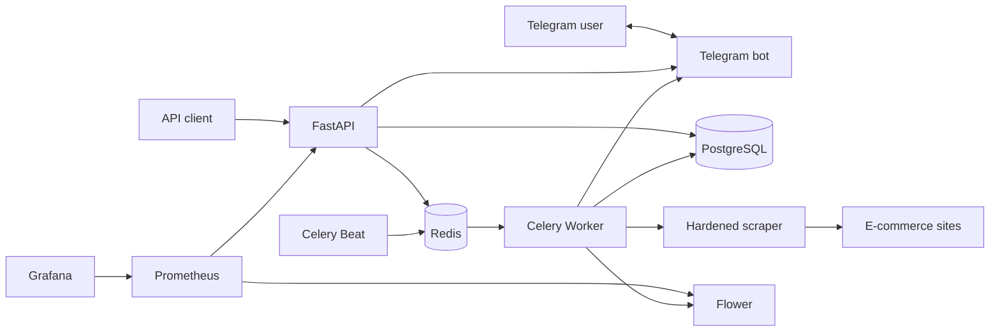

# Price Tracker


An asynchronous price-monitoring backend that tracks product prices, preserves their history, and sends Telegram alerts when a configured target price is reached.

The project combines a FastAPI REST API with scheduled Celery jobs, a hardened multi-strategy scraper, reliable notification delivery, and a provisioned Prometheus/Grafana monitoring stack.

## Highlights

- Target-price tracking with a complete price history
- Scheduled and independently retried price checks with Celery and Redis
- Telegram account linking, bot commands, and price-drop notifications
- SSRF-resistant scraping with domain allowlisting, redirect validation, and response-size limits
- JWT authentication, Argon2 password hashing, and endpoint rate limiting
- Idempotent notification events that prevent duplicate alerts
- Liveness, readiness, HTTP metrics, Celery metrics, and a provisioned Grafana dashboard
- Reproducible local environment built with Docker Compose and Alembic migrations

## Architecture



The API owns users, tracked items, target prices, and Telegram account linking. Celery Beat periodically dispatches work through Redis; workers scrape each item independently, persist price changes, and deliver pending notifications. Prometheus collects HTTP and Celery metrics, while Grafana provides the operational dashboard.

## Tech Stack

| Area | Technologies |
|---|---|
| API | Python 3.13, FastAPI, Pydantic |
| Persistence | PostgreSQL 15, async SQLAlchemy, asyncpg, Alembic |
| Background processing | Celery, Redis, Celery Beat |
| Scraping | HTTPX, Beautiful Soup, lxml |
| Telegram | aiogram |
| Security | JWT, Argon2, SlowAPI |
| Observability | Prometheus, Grafana, Flower |
| Testing | pytest, pytest-asyncio, pytest-cov |
| Infrastructure | Docker, Docker Compose, GitHub Actions |

## Quick Start

### 1. Clone the repository

```bash
git clone https://github.com/bohdan-tur/price-tracker.git
cd price-tracker
```

### 2. Configure the environment

```bash
cp .env.example .env
```

Run the following command twice to generate different JWT secrets containing at least 32 bytes each. Then set the required database, scraper, and Grafana values in `.env`. Telegram credentials are optional unless polling is enabled.

```bash
python -c "import secrets; print(secrets.token_urlsafe(48))"
```

The complete configuration template and safe development defaults are documented in [`.env.example`](.env.example).

### 3. Start the stack

```bash
docker compose up --build -d
```

Database migrations run automatically before the API starts.

### 4. Verify the deployment

```bash
docker compose ps
curl http://localhost:8000/health/ready
```

## Docker Services

| Service | URL / port | Purpose |
|---|---|---|
| FastAPI | [localhost:8000/docs](http://localhost:8000/docs) | REST API and Swagger UI |
| PostgreSQL | `localhost:5433` | Application database |
| Redis | `localhost:6380` | Celery broker and rate-limit storage |
| Flower | [localhost:5555](http://localhost:5555) | Celery worker and task monitoring |
| Prometheus | [localhost:9090](http://localhost:9090) | Metrics collection and querying |
| Grafana | [localhost:3000](http://localhost:3000) | Provisioned observability dashboard |

The `migrations` service applies Alembic migrations and exits. The isolated PostgreSQL test database is only started through the `test` profile:

```bash
docker compose --profile test up -d test_db
```

## Tracking Flow

Create an authenticated tracking request with a URL from the configured domain allowlist:

```http
POST /items/
Authorization: Bearer <access-token>
Content-Type: application/json
```

```json
{
  "title": "Example product",
  "url": "https://rozetka.com.ua/example-product/",
  "target_price": "25000.00"
}
```

The API validates the URL, stores the item with a `pending` status, and dispatches an independent Celery task. The worker then fetches the page, extracts the price, records the price history, and updates the item to `active` or `failed`. Subsequent checks are scheduled by Celery Beat.

## API Endpoints

The complete interactive contract is available through Swagger UI at [`/docs`](http://localhost:8000/docs).

| Method | Endpoint | Purpose |
|---|---|---|
| `POST` | `/auth/register` | Register a user |
| `POST` | `/auth/login` | Issue access and refresh tokens |
| `POST` | `/auth/refresh_token` | Issue a new access token |
| `GET` | `/users/me` | Read the current profile |
| `PATCH` | `/users/me/password` | Change the current password |
| `DELETE` | `/users/me` | Deactivate the current account |
| `POST` | `/items/` | Create a tracked item and enqueue its first check |
| `GET` | `/items/` | List the current user's items |
| `GET` | `/items/{item_id}/history` | Read an item's price history |
| `DELETE` | `/items/{item_id}` | Delete a tracked item |
| `POST` | `/telegram/link` | Create a one-time Telegram linking URL |
| `GET` | `/health/live` | Check whether the API process is running |
| `GET` | `/health/ready` | Check PostgreSQL and Redis readiness |
| `GET` | `/metrics` | Expose Prometheus HTTP metrics |

Administrative user-management endpoints are also available to superusers and documented in Swagger UI.

## Telegram Alerts

To enable the integration, create a bot through BotFather and configure `TELEGRAM_BOT_TOKEN`, `TELEGRAM_BOT_USERNAME`, and `TELEGRAM_POLLING_ENABLED=true`.

Linking uses a short-lived, single-use token:

1. An authenticated user calls `POST /telegram/link`.
2. The API returns a `t.me` deep link with an expiring token.
3. The user opens the link and starts the bot in a private chat.
4. The bot consumes the token and associates that Telegram account with the Price Tracker user.

The bot supports `/help`, `/list`, `/status`, and `/unlink`. When an active item reaches its target price, notification delivery is queued in Celery and tracked through an idempotent notification event.

## Observability

The monitoring stack is provisioned automatically with Docker Compose:

- FastAPI exposes HTTP request count and latency metrics at `/metrics`.
- Flower exposes Celery worker and task metrics.
- Prometheus collects both metric sources.
- Grafana loads the Prometheus datasource and the Price Tracker dashboard at startup.

The dashboard covers HTTP request rate, p95 latency, 5xx rate, responses by status class, online Celery workers, task throughput, and p95 task runtime.


_Provisioned Grafana dashboard during a controlled local load run._

### Controlled Local Load Run

The stack was verified with a short local run intended to validate metric collection and dashboard behavior, not to represent production capacity.

| Measurement | Result |
|---|---:|
| HTTP requests | 1,162 in 30 seconds |
| Concurrent clients | 5 |
| HTTP request failures | 0 |
| Average HTTP throughput during the run | ~39 requests/second |
| HTTP p95 latency | 95 ms |
| HTTP 5xx rate | 0% |
| Celery test tasks | 30 dispatched, 30 succeeded |
| Celery p95 task runtime | ~234 ms |

The load generator's throughput is calculated over the 30-second run, while the dashboard request-rate panels use rolling Prometheus windows; their displayed values therefore differ. Results are environment-dependent and are included as an observability smoke test rather than a performance guarantee.

## Database Seeding

Development seed data is disabled by default. Set `SEED_DEFAULT_USERS=true` together with `SEED_ADMIN_PASSWORD` and `SEED_USER_PASSWORD` to create one superuser and two regular demo users during API startup:

- `admin@price-tracker.com`
- `user4@example.com`
- `user5@example.com`

Seeding is rejected in production. Existing users are left unchanged, so enabling it repeatedly does not overwrite their passwords or account state.

## Testing

Start the isolated test database and run the suite inside the application image:

```bash
docker compose --profile test up -d test_db
docker compose --profile test run --rm --env-from-file .env \
  -e ENVIRONMENT=test api python -m pytest tests -v
```

Run the same suite with a terminal coverage report:

```bash
docker compose --profile test run --rm --env-from-file .env \
  -e ENVIRONMENT=test api python -m pytest tests --cov=app --cov-report=term-missing
```

GitHub Actions validates the Compose configuration, builds the API image, starts isolated infrastructure, and runs the test suite on every configured push and pull request.

## Background Processing

Celery tasks keep long-running and retryable work outside HTTP requests:

- a newly created item immediately dispatches its first independent price check;
- Celery Beat dispatches checks for tracked items every day at `03:00 UTC`;
- pending Telegram notifications are dispatched every minute;
- transient Telegram delivery errors use bounded retries and backoff.

Each item is processed separately, so a failed site or malformed product page does not stop checks for the remaining items.

## Scraping and Security

Price extraction follows a fallback pipeline: JSON-LD structured data, product-price metadata, and finally common CSS selectors.

The surrounding controls are as important as extraction itself:

- domain allowlisting and URL-length validation;
- DNS resolution checks that reject private, loopback, link-local, and other non-global targets;
- redirect revalidation to prevent allowlist bypasses;
- streamed response-size enforcement;
- separate JWT secrets for access and refresh tokens;
- Argon2 password hashing through `pwdlib`;
- Redis-backed rate limits on authentication, item creation, and Telegram linking;
- ownership checks for user-scoped items and price history.

## Author

**Bohdan Turevych**

- GitHub: [@bohdan-tur](https://github.com/bohdan-tur)
- LinkedIn: [Bohdan Turevych](https://www.linkedin.com/in/bohdan-turevych)
