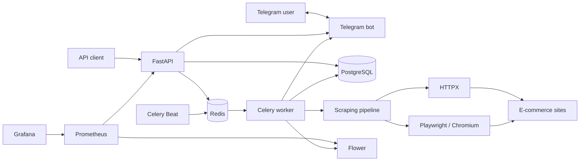
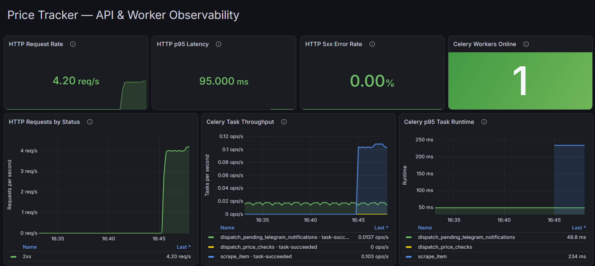

# Price Tracker

[](https://github.com/bohdan-tur/price-tracker/actions/workflows/ci.yml)
[](https://app.codecov.io/github/bohdan-tur/price-tracker)
[](https://www.python.org/)
[](https://fastapi.tiangolo.com/)
[](https://www.postgresql.org/)
[](https://redis.io/)
[](https://docs.docker.com/compose/)

An asynchronous price-monitoring backend that tracks products, preserves price
history, and sends Telegram alerts when a configured target price is reached.
It combines a FastAPI REST API with scheduled Celery jobs, defensive web
scraping, reliable notification delivery, and a provisioned observability
stack.

## Highlights

- Complete target-price and price-history workflow.
- Independent Celery tasks so one failed product page does not block other
  checks.
- Telegram account linking, bot commands, and idempotent price-drop alerts.
- SSRF-resistant scraping with domain allowlisting, DNS and redirect
  validation, and response-size limits.
- Selective Playwright fallback for JavaScript-rendered product pages while
  static storefronts continue to use lightweight HTTP requests.
- JWT authentication, Argon2 password hashing, ownership checks, and
  Redis-backed rate limiting.
- Prometheus metrics for HTTP and Celery workloads with a provisioned Grafana
  dashboard.
- Reproducible Docker Compose environment, Alembic migrations, and CI checks.

## Architecture



The API owns users, tracked items, target prices, and Telegram account links.
Celery Beat dispatches scheduled work through Redis. Workers scrape each item
independently, persist price changes, and deliver pending notifications.
Prometheus collects API and Celery metrics, while Grafana visualizes system
behavior.

## Tech stack

| Area | Technologies |
|---|---|
| API | Python 3.13, FastAPI, Pydantic v2, Uvicorn |
| Persistence | PostgreSQL 15, SQLAlchemy 2 async, asyncpg, Alembic |
| Background processing | Celery, Redis, Celery Beat |
| Scraping | HTTPX, Playwright, Chromium, Beautiful Soup, lxml |
| Telegram | aiogram |
| Security | JWT, Argon2, SlowAPI |
| Observability | Prometheus, Grafana, Flower |
| Testing and quality | Pytest, pytest-asyncio, pytest-cov, Ruff, pip-audit |
| Infrastructure | Docker, Docker Compose, GitHub Actions |

## Quick start

### Prerequisites

- Git
- Docker Engine or Docker Desktop with Docker Compose

### 1. Clone and configure

```bash
git clone https://github.com/bohdan-tur/price-tracker.git
cd price-tracker
cp .env.example .env
```

Generate two different JWT secrets and place them in `.env`:

```bash
python -c "import secrets; print(secrets.token_urlsafe(48))"
python -c "import secrets; print(secrets.token_urlsafe(48))"
```

Replace the database and Grafana passwords. Telegram credentials are optional
unless bot polling is enabled. All supported variables are documented in
[`.env.example`](.env.example).

### 2. Start and verify the stack

```bash
docker compose up --build -d
docker compose ps
curl http://localhost:8000/health/ready
```

Alembic migrations run automatically before the API starts.

| Service | Address | Purpose |
|---|---|---|
| Swagger UI | <http://localhost:8000/docs> | Interactive API documentation |
| PostgreSQL | `localhost:5433` | Application database |
| Redis | `localhost:6380` | Celery broker and rate-limit storage |
| Flower | <http://localhost:5555> | Worker and task monitoring |
| Prometheus | <http://localhost:9090> | Metric collection and queries |
| Grafana | <http://localhost:3000> | Provisioned dashboard |

Stop the containers without deleting persisted data:

```bash
docker compose down
```

Add `-v` only when you intentionally want to remove the database and Grafana
volumes.

## Core workflow

Create an authenticated tracking request using a URL from the configured domain
allowlist:

```http
POST /items/
Authorization: Bearer <access-token>
Content-Type: application/json
```

```json
{
  "title": "Example product",
  "url": "https://rozetka.com.ua/example-product/",
  "target_price": "25000.00"
}
```

The API validates the URL, stores the item with a `pending` status, and
dispatches its first check. The worker extracts the price, appends to the price
history, and changes the item status to `active` or `failed`. Celery Beat handles
subsequent checks.

## API overview

The complete contract is available in Swagger UI at
[`/docs`](http://localhost:8000/docs).

| Method | Endpoint | Purpose |
|---|---|---|
| `POST` | `/auth/register` | Register a user |
| `POST` | `/auth/login` | Issue access and refresh tokens |
| `POST` | `/auth/refresh_token` | Issue a new access token |
| `GET` | `/users/me` | Read the current profile |
| `PATCH` | `/users/me/password` | Change the current password |
| `DELETE` | `/users/me` | Deactivate the current account |
| `POST` | `/items/` | Create an item and enqueue its first check |
| `GET` | `/items/` | List the current user's items |
| `GET` | `/items/{item_id}/history` | Read price history |
| `DELETE` | `/items/{item_id}` | Delete a tracked item |
| `POST` | `/telegram/link` | Create a one-time Telegram linking URL |
| `GET` | `/health/live` | Liveness probe |
| `GET` | `/health/ready` | PostgreSQL and Redis readiness probe |
| `GET` | `/metrics` | Prometheus metrics |

Administrative user-management endpoints are restricted to superusers and are
documented in Swagger UI.

## Telegram integration

Create a bot through BotFather and configure `TELEGRAM_BOT_TOKEN`,
`TELEGRAM_BOT_USERNAME`, and `TELEGRAM_POLLING_ENABLED=true`.

Account linking uses a short-lived, single-use token:

1. An authenticated user calls `POST /telegram/link`.
2. The API returns a `t.me` deep link containing the token.
3. The user starts the bot in a private chat.
4. The bot consumes the token and links the Telegram account.

The bot supports `/help`, `/list`, `/status`, and `/unlink`. When an active item
reaches its target, delivery is queued and recorded through an idempotent
notification event to prevent duplicate alerts.

## Background processing

- New items immediately dispatch an independent price check.
- Celery Beat dispatches scheduled checks every day at `03:00 UTC`.
- Pending Telegram notifications are dispatched every minute.
- Transient Telegram failures use bounded retries and backoff.

Each item is processed independently, so a failed site or malformed page does
not stop checks for the remaining items.

## Scraping and security

Price extraction uses a fallback pipeline: JSON-LD structured data,
product-price metadata, and common CSS selectors. The surrounding controls are
equally important:

Static storefronts are fetched with HTTPX. Storefronts that render product data
with JavaScript can be routed selectively through headless Chromium using
Playwright. The browser waits for product JSON-LD, returns only the relevant
structured-data fragments, and reuses the same extraction pipeline as the HTTP
path. Browser scraping is controlled by an environment feature flag, runs as a
non-root user in Docker, and uses limited worker concurrency to control memory
usage.

- domain allowlisting and URL-length validation;
- DNS checks that reject private, loopback, link-local, and other non-global
  targets;
- redirect revalidation to prevent allowlist bypasses;
- streamed response-size enforcement;
- separate signing secrets for access and refresh tokens;
- Argon2 password hashing;
- rate limits on authentication, item creation, and Telegram linking;
- ownership checks for user-scoped items and history.

## Observability

The monitoring stack is provisioned automatically:

- FastAPI exposes request count and latency metrics at `/metrics`.
- Flower exposes Celery worker and task metrics.
- Prometheus collects both sources.
- Grafana loads the datasource and dashboard at startup.

The dashboard covers HTTP request rate, p95 latency, 5xx rate, responses by
status class, online Celery workers, task throughput, and p95 task runtime.



_Provisioned dashboard during a controlled local observability run._

| Measurement | Result |
|---|---:|
| HTTP requests | 1,162 in 30 seconds |
| Concurrent clients | 5 |
| HTTP request failures | 0 |
| Average HTTP throughput | ~39 requests/second |
| HTTP p95 latency | 95 ms |
| HTTP 5xx rate | 0% |
| Celery test tasks | 30 dispatched, 30 succeeded |
| Celery p95 task runtime | ~234 ms |

These environment-dependent results validate metric collection and dashboard
behavior; they are not presented as production capacity claims. Prometheus uses
rolling windows, so dashboard request rates differ from the load generator's
whole-run average.

## Testing and quality

Run the suite against the isolated PostgreSQL test database:

```bash
docker compose --profile test up -d test_db
docker compose --profile test run --rm --env-from-file .env \
  -e ENVIRONMENT=test api python -m pytest tests -v
```

Run with coverage:

```bash
docker compose --profile test run --rm --env-from-file .env \
  -e ENVIRONMENT=test api python -m pytest tests \
  --cov=app --cov-report=term-missing
```

Local quality checks:

```bash
ruff check .
ruff format --check .
pip-audit -r requirements.txt
```

GitHub Actions audits dependencies, checks formatting and linting, validates
Compose, builds the API image, starts isolated infrastructure, and runs the test
suite on configured pushes and pull requests. CI measures line and branch
coverage, enforces a 75% minimum, archives `coverage.xml`, and publishes results
to Codecov.

## Project structure

```text
price-tracker/
|-- app/                         # API, models, services, bot, and workers
|-- migration/                   # Alembic environment and revisions
|-- monitoring/                  # Prometheus and Grafana provisioning
|-- docs/images/                 # README assets
|-- tests/                       # API, worker, scraper, and security tests
|-- .github/workflows/ci.yml     # Continuous integration
|-- docker-compose.yaml          # Local multi-service environment
|-- Dockerfile
|-- .env.example
`-- requirements.txt
```

## Author

**Bohdan Turevych**

- GitHub: [@bohdan-tur](https://github.com/bohdan-tur)
- LinkedIn: [Bohdan Turevych](https://www.linkedin.com/in/bohdan-turevych)

